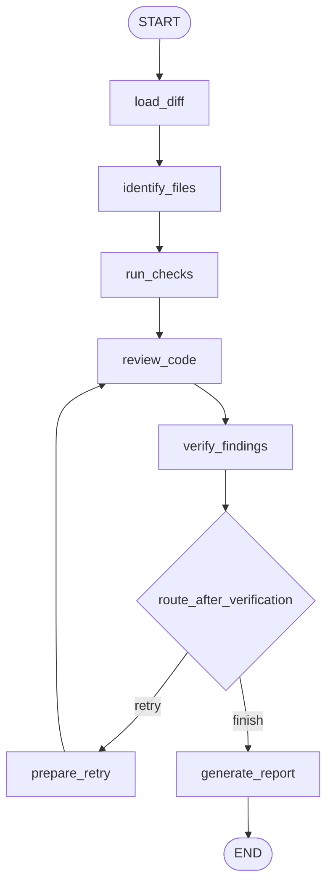

# Agentic Pull Request Reviewer

A LangGraph workflow that reviews a local Git diff, runs deterministic checks (pytest / ruff), proposes structured findings with an LLM, critiques those findings with a verifier, and prints a Markdown PR review.

```bash
python main.py --diff examples/buggy_null.diff
# or
python main.py --repo ./my-project --base HEAD~1
```

Requires `OPENAI_API_KEY` (set in `.env` or exported in your shell).

## Why LangGraph

LangGraph models the review as an explicit state machine:

- **State** is the shared clipboard (diff, findings, retry count, report).
- **Nodes** are single-purpose functions (load, check, review, verify, report).
- **Edges** (including conditional ones) decide the next step — including a bounded reviewer → verifier retry loop.

That makes the agentic loop inspectable and testable, instead of burying control flow inside one prompt.

## Architecture

```text
START
  ↓
load_diff
  ↓
identify_files
  ↓
run_checks          (pytest / ruff — no LLM)
  ↓
review_code         (LLM → structured findings)
  ↓
verify_findings     (LLM → accept / reject)
  ↓
route_after_verification
  ├── retry (max 1) → prepare_retry → review_code
  └── finish → generate_report → END
```



## Node descriptions

| Node | Role |
|------|------|
| `load_diff` | Validate / load the patch; reject empty or oversized diffs |
| `identify_files` | Parse changed file paths from the unified diff |
| `run_checks` | Run ruff and pytest when `--repo` is provided |
| `review_code` | LLM review focused on real defects; uses verifier feedback on retry |
| `verify_findings` | LLM critique; rejects unsupported / vague findings |
| `prepare_retry` | Increment `retry_count` (budget: 1) |
| `generate_report` | Emit Markdown + stats (files, rejected count, elapsed time) |

## Setup

```bash
python -m venv .venv
source .venv/bin/activate
pip install -r requirements.txt
cp .env.example .env   # then edit .env and set OPENAI_API_KEY=sk-...
```

## Example input

`examples/buggy_null.diff` removes a null check:

```python
user = self.repository.find_by_id(user_id)
return user.email  # AttributeError if user is None
```

## Example output

```markdown
# PR Review

## High severity

### Correctness
**File:** user_service.py, line 15

find_by_id may return None before .email is accessed.

**Suggested fix:**

Check for None and raise LookupError.

## Automated checks

- Skipped static checks: no --repo provided.

## Stats

- Files reviewed: 1
- Candidate findings: 1
- Verified findings: 1
- Findings rejected by verifier: 0
- Review retries: 0
- Elapsed seconds: 2.41
```

## Failure-handling rules

- Empty diffs fail with a clear error before any LLM call.
- Diffs larger than 100,000 characters are rejected.
- Invalid structured model output is dropped rather than crashing the graph.
- Verifier failures keep candidates (best-effort) and do not spin forever.
- At most **one** review retry; LangGraph `recursion_limit` is an extra safeguard.
- Missing `ruff` / `pytest` is reported as skipped, not fatal.

## Evaluation

Three fixture diffs under `examples/`:

| Fixture | Expectation |
|---------|-------------|
| `buggy_null.diff` | Verified `correctness` finding (null / index risk) |
| `clean_change.diff` | No verified defects after verifier rejects fluff |
| `failing_test/` | `pytest` reports failure in static checks |

Run the automated suite (LLM calls mocked):

```bash
pytest -q
```

Do not claim false-positive reduction percentages without measuring against a labeled set.

## Project layout

```text
reviewer/          # LangGraph package (state, nodes, routes, graph, …)
examples/          # Sample diffs + tiny failing pytest package
tests/             # Unit + graph trajectory tests
main.py            # CLI
requirements.txt
```
