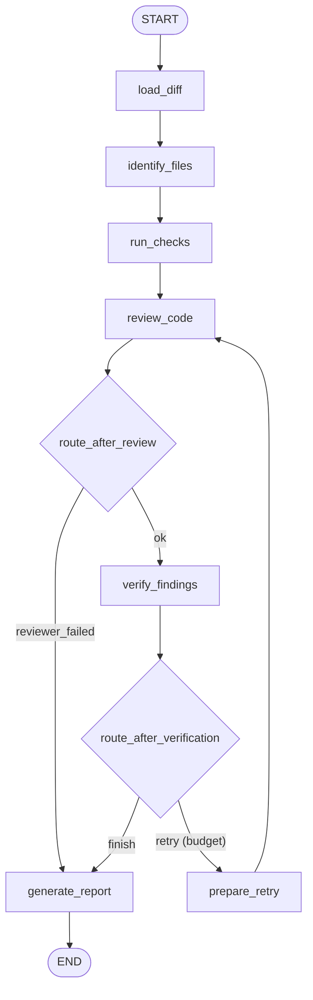

# Agentic Pull Request Reviewer

A LangGraph workflow that reviews a Git diff, proposes structured findings with an LLM, critiques those findings with a second LLM (the verifier), and prints a Markdown PR review. It is **provider-agnostic** (OpenAI, Anthropic, Google, Groq, Mistral) and **fails closed**: model or verifier failures are reported as incomplete, never as a clean bill of health.

- Reviewer -> verifier loop with a configurable retry budget
- Auto-detects the LLM provider from whichever API key you set
- Deterministic, opt-in `ruff`/`pytest` checks
- Ships as a CLI and as GitHub Actions workflows (PR comments, commit reviews)

---

## Table of contents

- [Install](#install)
- [Quickstart](#quickstart)
- [Usage](#usage)
  - [Options](#options)
  - [Worked examples](#worked-examples)
  - [Large diffs](#large-diffs)
  - [Exit codes](#exit-codes)
  - [Where the output goes](#where-the-output-goes)
- [Providers](#providers)
- [Retries](#retries)
- [Configuration reference](#configuration-reference)
- [How it works](#how-it-works)
- [GitHub integration](#github-integration)
- [Security and privacy](#security-and-privacy)
- [Releasing](#releasing-maintainers)
- [Limitations](#limitations)

---

## Install

Isolated CLI (recommended - does not pollute a project's environment):

```bash
pipx install agentic-pr-reviewer
# or
uv tool install agentic-pr-reviewer
```

Into an environment:

```bash
pip install agentic-pr-reviewer
```

Add a non-OpenAI provider via extras:

```bash
pip install "agentic-pr-reviewer[anthropic]"   # or [google], [groq], [mistral], [all]
```

Pin the version in security-sensitive workflows (e.g. `agentic-pr-reviewer==0.3.0`).

## Quickstart

```bash
# 1. Set one provider API key (OpenAI shown; see Providers for others)
export OPENAI_API_KEY=sk-...

# 2. From your repo root, review the latest commit
agentic-pr-reviewer --base HEAD~1
```

The Markdown review prints to your terminal. That's it. Everything below is optional tuning.

## Usage

```text
agentic-pr-reviewer [--repo PATH | --diff FILE] [--base REV]
                    [--provider {auto,openai,anthropic,google,groq,mistral}]
                    [--model NAME] [--max-retries N] [--max-diff-chars N]
                    [--output FILE] [--run-checks] [--version] [-h | -help | --help]
```

You choose the input (a live git repo or a saved diff file) and, optionally, the provider/model and a few limits. Run it from the repository root so its `.env` is discovered.

### Options

| Flag | Type / values | Default | What it does |
|------|---------------|---------|--------------|
| `--repo PATH` | path | `.` (cwd) | Review a local git repo by running `git diff <base>`. Mutually exclusive with `--diff`. |
| `--diff FILE` | path | - | Review a saved unified diff file instead of invoking git. Mutually exclusive with `--repo`. |
| `--base REV` | git revision | `HEAD~1` | What to diff against (e.g. `main`, `origin/main`, a SHA). Only used with `--repo`. |
| `--provider` | `auto`/`openai`/`anthropic`/`google`/`groq`/`mistral` | `auto` | LLM provider. `auto` picks the one whose API key is set. |
| `--model NAME` | string | provider default | Model to use for the chosen provider. |
| `--max-retries N` | int >= 0, or `unlimited` | `1` | Reviewer<->verifier retry budget. `0` disables retries. |
| `--max-diff-chars N` | int | `100000` | Cap the diff size; larger diffs are truncated and the run is marked `partial`. |
| `--output FILE` | path | - | Write the Markdown review to a file (also still printed to stdout). |
| `--run-checks` | flag | off | Also run the target repo's `ruff`/`pytest`. Executes that repo's code - only for repos you trust. |
| `--version` | flag | - | Print the version and exit. |
| `-h`, `-help`, `--help` | flag | - | Show help with usage examples and exit. |

### Worked examples

```bash
# Review the latest commit (current repo vs its parent)
agentic-pr-reviewer --base HEAD~1

# Review your working changes against a branch
agentic-pr-reviewer --base main

# Review a different repository
agentic-pr-reviewer --repo ./other-project --base main

# Review a saved unified diff and write the report to a file
git diff main > changes.diff
agentic-pr-reviewer --diff changes.diff --output review.md

# Use Anthropic Claude instead of OpenAI
export ANTHROPIC_API_KEY=...
agentic-pr-reviewer --provider anthropic --model claude-3-5-sonnet-latest

# Let the reviewer iterate more before giving up
agentic-pr-reviewer --base main --max-retries 3

# Review a very large diff without truncation
agentic-pr-reviewer --base main --max-diff-chars 500000

# Also run the repo's ruff + pytest (trusted repos only)
agentic-pr-reviewer --base main --run-checks
```

Input selection rules: `--repo` and `--diff` cannot be combined; if you pass neither, the current directory is used as the repo.

### Large diffs

Instead of failing on huge diffs, the reviewer **truncates** to `--max-diff-chars` (default 100,000), cutting on a line boundary and appending a marker. The run is then reported as `partial` with a warning, and the exit code stays `0`. Raise the cap with `--max-diff-chars`, or split the change into smaller PRs for a complete review. (Chunked multi-call review of an entire large diff is not implemented.)

### Exit codes

| Code | Meaning |
|------|---------|
| `0` | Success, or completed with warnings (`partial`, including truncated diffs) |
| `1` | Review incomplete - the reviewer or verifier model failed |
| `2` | Invalid input or configuration - empty/unparseable diff, no API key, or an ambiguous provider |

Branch on it in a script or CI:

```bash
agentic-pr-reviewer --base main --output review.md
case $? in
  0) echo "review complete" ;;
  1) echo "model failure - treat as inconclusive" ;;
  2) echo "bad input/config" ;;
esac
```

### Where the output goes

- **stdout**: the full Markdown review (always).
- **`--output FILE`**: the same Markdown written to a file too (written even on failure, so CI can always attach a report).
- **stderr**: only errors/warnings (missing key, `--run-checks` notice), kept separate so you can pipe stdout cleanly.

## Providers

The provider is auto-detected from whichever API key is present, so you usually only export a key.

| Provider | Install | API key env var | Default model |
|----------|---------|-----------------|---------------|
| OpenAI | bundled | `OPENAI_API_KEY` | `gpt-4o-mini` |
| Anthropic | `pip install "agentic-pr-reviewer[anthropic]"` | `ANTHROPIC_API_KEY` | `claude-3-5-sonnet-latest` |
| Google Gemini | `pip install "agentic-pr-reviewer[google]"` | `GOOGLE_API_KEY` | `gemini-1.5-flash` |
| Groq | `pip install "agentic-pr-reviewer[groq]"` | `GROQ_API_KEY` | `llama-3.3-70b-versatile` |
| Mistral | `pip install "agentic-pr-reviewer[mistral]"` | `MISTRAL_API_KEY` | `mistral-small-latest` |

Install everything with `pip install "agentic-pr-reviewer[all]"`.

Resolution rules:

- **Exactly one key set** -> that provider is used.
- **Several keys set** -> choose with `--provider` (or `PR_REVIEWER_PROVIDER`); otherwise you get a clear "ambiguous" error.
- **No key set** -> clear error listing the supported env vars (exit `2`).
- **Model**: `--model` overrides the default (or `PR_REVIEWER_MODEL`; `OPENAI_MODEL` still works for OpenAI).
- **Missing integration package**: selecting a provider whose extra is not installed prints an install hint (e.g. `pip install "agentic-pr-reviewer[anthropic]"`).

## Retries

The reviewer proposes findings; the verifier accepts/rejects them and can request a retry with feedback, which is fed back into the next review pass. `--max-retries` controls the budget:

- `--max-retries 0` - single pass, no retry.
- `--max-retries N` - up to N retries.
- `--max-retries unlimited` - retry until the verifier is satisfied, still bounded by an internal safety cap (LangGraph requires a finite recursion limit). The recursion limit scales with the budget.

## Configuration reference

`.env` is loaded from the directory you run the command in (run from your repo root). Recognized variables:

| Variable | Purpose |
|----------|---------|
| `OPENAI_API_KEY` / `ANTHROPIC_API_KEY` / `GOOGLE_API_KEY` / `GROQ_API_KEY` / `MISTRAL_API_KEY` | Provider API keys (presence drives auto-detection) |
| `PR_REVIEWER_PROVIDER` | Force a provider (same as `--provider`) |
| `PR_REVIEWER_MODEL` | Force a model (same as `--model`) |
| `OPENAI_MODEL` | Back-compat model override for OpenAI |

CLI flags always take precedence over environment variables.

## How it works

LangGraph models the review as an explicit state machine, so the control flow is inspectable and testable instead of buried in one prompt.



| Node | Role |
|------|------|
| `load_diff` | Validate/load the patch; empty -> `input_error`; oversized -> truncate + `partial` |
| `identify_files` | Parse changed file paths from the unified diff |
| `run_checks` | Run ruff + pytest, only when `--run-checks` is set |
| `review_code` | LLM review; drops findings outside the diff; fails closed on model errors |
| `verify_findings` | LLM critique; rejects unsupported findings; never promotes unverified candidates |
| `prepare_retry` | Increment `retry_count` (bounded by `--max-retries`) |
| `generate_report` | Emit status-aware Markdown + stats |

### Review status

| Status | Meaning | Exit |
|--------|---------|------|
| `success` | Completed; every surviving finding was verified | 0 |
| `partial` | Completed with warnings (truncated diff, dropped/malformed findings, checks unavailable) | 0 |
| `input_error` | Empty or unparseable diff | 2 |
| `reviewer_failed` | Reviewer model errored or returned only malformed output | 1 |
| `verifier_failed` | Verifier errored; candidates surfaced as unverified, never confirmed | 1 |

A `partial` or failed run is never reported as "No verified defects found".

## GitHub integration

This repo ships four workflows:

| Workflow | Trigger | Output | Secrets |
|----------|---------|--------|---------|
| `ci.yml` | PR + push to main | ruff/pytest check status | none |
| `pr-review.yml` | `pull_request_target` (opened/synchronize/reopened) | sticky PR comment | provider key |
| `commit-review.yml` | push to `main` | job summary + `review.md` artifact | provider key |
| `publish.yml` | tag `v*` | PyPI release (Trusted Publishing) | none (OIDC) |

Note: the PR-commenting behavior is **workflow plumbing in this repo**, not part of the pip package. The package only generates the Markdown; posting it as a comment is done by a workflow step (`actions/github-script`). To add automated reviews to another repo, drop in a workflow and set the provider key as a secret:

```yaml
name: PR Review
on:
  pull_request_target:
    types: [opened, synchronize, reopened]
permissions:
  contents: read
  pull-requests: write
jobs:
  review:
    runs-on: ubuntu-latest
    steps:
      - name: Get PR diff (as data, never executed)
        env:
          GH_TOKEN: ${{ secrets.GITHUB_TOKEN }}
          GH_REPO: ${{ github.repository }}
          PR: ${{ github.event.pull_request.number }}
        run: gh api -H "Accept: application/vnd.github.diff" "/repos/$GH_REPO/pulls/$PR" > pr.diff
      - run: pip install agentic-pr-reviewer
      - env:
          OPENAI_API_KEY: ${{ secrets.OPENAI_API_KEY }}
        run: agentic-pr-reviewer --diff pr.diff --output review.md
      # ...then post review.md as a comment with actions/github-script
```

Add `OPENAI_API_KEY` (or another provider key) under repo Settings -> Secrets and variables -> Actions. Fork PRs do not receive secrets, so those post a "skipped" note.

## Security and privacy

- **Secret-free CI** (`ci.yml`): runs ruff + pytest on PR code with no secrets, so untrusted PR code is safe to execute.
- **Trusted review** (`pr-review.yml`): uses `pull_request_target` (which has secrets), so it **never checks out or executes PR head code** - it reads the PR diff as data via the API.
- **`--run-checks` is opt-in**: it runs the target repo's tests/linters, which executes that repo's code. Off by default; only enable for repos you trust.
- **Prompt-injection**: the diff, code, comments, filenames, and tool output are treated as untrusted data in both system prompts.
- **Privacy**: the diff (and, with `--run-checks`, test/lint output) is sent to the configured model provider. Do not run it on diffs you cannot share with that provider. Secrets/environment variables are never sent to the model.

## Releasing (maintainers)

Releases publish to PyPI via Trusted Publishing (OIDC, no stored token) on a `v*` tag. Plain pushes do **not** publish.

```bash
# 1. bump version in pyproject.toml (PyPI cannot overwrite an existing version)
# 2. commit + push main
# 3. tag and push the tag -> publish.yml publishes
git tag v0.3.0 && git push origin v0.3.0
```

Local rehearsal before tagging:

```bash
rm -rf build dist && python -m build && python -m twine check dist/*
```

One-time PyPI setup: add a pending Trusted Publisher (GitHub) for project `agentic-pr-reviewer`, repo `BitBucket0/agentic-pr-reviewer`, workflow `publish.yml`, environment `pypi`.

## Limitations

- Deterministic checks are Python-focused (ruff/pytest); other languages get diff-only LLM review.
- No measured detection accuracy yet; tests verify control flow and failure behavior, not model quality.
- Large diffs are truncated, not chunked - very large PRs get a partial review.
- Configurable retry loop, but not a fully autonomous multi-tool agent.

## Development

```bash
python -m venv .venv && source .venv/bin/activate
pip install -e ".[checks]"
pytest -q
ruff check .
```
