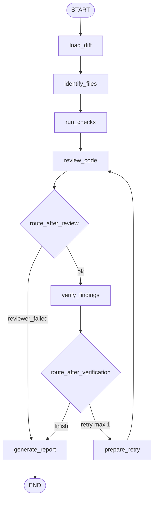

# Agentic Pull Request Reviewer

A LangGraph workflow that reviews a Git diff, optionally runs deterministic checks (pytest / ruff), proposes structured findings with an LLM, critiques those findings with a verifier, and prints a Markdown PR review. It fails closed: model or verifier failures are reported as incomplete, never as a clean bill of health.

## Install

Isolated CLI install (recommended — does not pollute a project's environment):

```bash
pipx install agentic-pr-reviewer
# or
uv tool install agentic-pr-reviewer
```

Or into an environment:

```bash
pip install agentic-pr-reviewer
```

In security-sensitive workflows, pin the version (e.g. `agentic-pr-reviewer==0.2.0`).

Set one provider API key (in a `.env` in the directory you run from, or exported in your shell). Run the command from your repository root so its `.env` is picked up. See [Providers](#providers) for non-OpenAI options.

## Usage

```bash
# Review the current repo against the previous commit
agentic-pr-reviewer --base HEAD~1

# Review a specific repo / base
agentic-pr-reviewer --repo ./my-project --base main

# Review a saved unified diff and save the report
agentic-pr-reviewer --diff changes.diff --output review.md

# Pick a provider/model and allow more reviewer<->verifier retries
agentic-pr-reviewer --provider anthropic --model claude-3-5-sonnet-latest --max-retries 3
```

`--repo` and `--diff` are mutually exclusive; with neither, the current directory is used. Deterministic checks are **opt-in** via `--run-checks` (see Security).

## Providers

The reviewer auto-detects the provider from whichever API key is set, so you only have to export a key:

| Provider | Install | API key | Default model |
|----------|---------|---------|---------------|
| OpenAI | (bundled) | `OPENAI_API_KEY` | `gpt-4o-mini` |
| Anthropic | `pip install "agentic-pr-reviewer[anthropic]"` | `ANTHROPIC_API_KEY` | `claude-3-5-sonnet-latest` |
| Google Gemini | `pip install "agentic-pr-reviewer[google]"` | `GOOGLE_API_KEY` | `gemini-1.5-flash` |
| Groq | `pip install "agentic-pr-reviewer[groq]"` | `GROQ_API_KEY` | `llama-3.3-70b-versatile` |
| Mistral | `pip install "agentic-pr-reviewer[mistral]"` | `MISTRAL_API_KEY` | `mistral-small-latest` |

Install every provider with `pip install "agentic-pr-reviewer[all]"`.

- **Auto-detection:** if exactly one key is set, it is used. If several are set, choose with `--provider` (or `PR_REVIEWER_PROVIDER`). If none are set, the command exits with a clear error.
- **Model:** override the default with `--model` (or `PR_REVIEWER_MODEL`; `OPENAI_MODEL` still works for OpenAI).

## Retries

The reviewer critiques its own findings and can retry with feedback. `--max-retries` controls the budget (default `1`):

- `--max-retries 0` — single pass, no retry.
- `--max-retries N` — up to N retries.
- `--max-retries unlimited` — retry until the verifier is satisfied, still bounded by an internal safety cap (LangGraph requires a finite recursion limit).

## Why LangGraph

LangGraph models the review as an explicit state machine:

- **State** is the shared clipboard (diff, findings, status, retry count, report).
- **Nodes** are single-purpose functions (load, check, review, verify, report).
- **Edges** (including conditional ones) decide the next step — including skipping verification when the reviewer fails and a bounded reviewer -> verifier retry loop.

That makes the agentic loop inspectable and testable, instead of burying control flow inside one prompt.

## Architecture



| Node | Role |
|------|------|
| `load_diff` | Validate / load the patch; reject empty or oversized diffs (`input_error`) |
| `identify_files` | Parse changed file paths from the unified diff |
| `run_checks` | Run ruff and pytest, only when `--run-checks` is set |
| `review_code` | LLM review focused on real defects; drops findings outside the diff; fails closed on model errors |
| `verify_findings` | LLM critique; rejects unsupported findings; never promotes unverified candidates |
| `prepare_retry` | Increment `retry_count` (budget: 1) |
| `generate_report` | Emit status-aware Markdown + stats |

## Review status

Every run ends with a `status` that the report and CLI exit code reflect:

| Status | Meaning | Exit code |
|--------|---------|-----------|
| `success` | Completed; every surviving finding was verified | 0 |
| `partial` | Completed with warnings (malformed/out-of-diff findings dropped, or checks unavailable) | 0 |
| `input_error` | Empty, oversized, or unparseable diff | 2 |
| `reviewer_failed` | Reviewer model errored or returned only malformed output | 1 |
| `verifier_failed` | Verifier errored; candidates surfaced as unverified, never confirmed | 1 |

A `partial` or failed run is never reported as "No verified defects found".

## Security model

- **Secret-free CI** ([.github/workflows/ci.yml](.github/workflows/ci.yml)): runs ruff + pytest on PR code. It holds no secrets, so executing untrusted PR code is safe.
- **Trusted review** ([.github/workflows/pr-review.yml](.github/workflows/pr-review.yml)): uses `pull_request_target` (which has secrets), so it **never checks out or executes PR head code**. It installs the trusted reviewer from the base branch and reads the PR diff as data via the GitHub API, then posts a sticky comment.
- **Local checks are opt-in**: `--run-checks` runs the target repo's pytest/ruff, which executes that repo's code. It is off by default and prints a warning; only enable it for repositories you trust.
- **Prompt-injection**: the diff, comments, filenames, and tool output are treated as untrusted data in both system prompts; instructions embedded in them are ignored.

## Privacy

The diff (and, with `--run-checks`, test/lint output) is sent to the configured model provider (OpenAI by default). Do not run it on diffs you cannot share with that provider. Secrets and environment variables are never sent to the model.

## GitHub integration

| Workflow | Trigger | Output | Secrets |
|----------|---------|--------|---------|
| `ci.yml` | PR + push to main | check status | none |
| `pr-review.yml` | `pull_request_target` (opened/synchronize/reopened) | sticky PR comment | `OPENAI_API_KEY` |
| `commit-review.yml` | push to `main` | job summary + artifact | `OPENAI_API_KEY` |
| `publish.yml` | tag `v*` | PyPI release (Trusted Publishing) | none (OIDC) |

**One-time setup:** add `OPENAI_API_KEY` under repo Settings > Secrets and variables > Actions. Optionally set an `OPENAI_MODEL` variable (default `gpt-4o-mini`).

**Caveat:** GitHub does not expose secrets to pull requests from forks, so those PRs post a "skipped" note.

## Deterministic and trajectory tests

Automated tests (LLM calls mocked) cover input validation, routing, fail-closed statuses, out-of-diff/path-normalized filtering, and CLI exit codes:

```bash
pip install -e ".[checks]"
pytest -q
```

These verify control flow and failure behavior — not model accuracy. A labeled evaluation of real review quality is future work; no accuracy percentages are claimed until measured.

## Publishing (maintainers)

Releases go out via `publish.yml` on a `v*` tag using PyPI Trusted Publishing (OIDC, no stored token).

One-time PyPI setup (cannot be automated from CI): at pypi.org, create/verify the account, then Publishing -> add a pending Trusted Publisher with:

| Field | Value |
|-------|-------|
| PyPI Project Name | `agentic-pr-reviewer` |
| Owner | `BitBucket0` |
| Repository | `agentic-pr-reviewer` |
| Workflow | `publish.yml` |
| Environment | `pypi` |

Then cut a release:

```bash
git tag v0.2.0 && git push origin v0.2.0   # triggers publish.yml
```

Local rehearsal before tagging:

```bash
rm -rf build dist && python -m build && python -m twine check dist/*
```

## Limitations

- Python-focused (ruff/pytest checks). Other languages get diff-only LLM review.
- No measured detection accuracy yet (see tests note above).
- Configurable retry loop, but not a fully autonomous multi-tool agent.

## Project layout

```text
reviewer/          # LangGraph package (state, schemas, prompts, nodes, routes, graph, cli)
examples/          # Sample diffs + tiny failing pytest package
tests/             # Unit, graph trajectory, and CLI tests
.github/workflows/ # ci, pr-review, commit-review, publish
pyproject.toml     # packaging + dependencies
```
